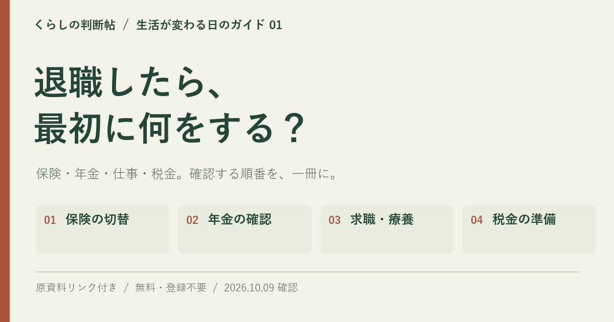

# 告知・募集の原稿集

2026年10月9日作成。**以下はすべて未投稿・未送信の草稿です。** 掲載先、投稿日時、返答先は制作者が選びます。

優先入口：[退職したら、最初に何をする？](https://gerrygao1995-coder.github.io/japan-life-playbook/start/leaving-work.html)

## 専用の表紙

退職特集のために制作したオリジナルの共有画像です。プロジェクト全体の表紙とは使い分けます。

[](https://gerrygao1995-coder.github.io/japan-life-playbook/start/leaving-work.html)

画像ファイル：[leaving-work-cover.png](leaving-work-cover.png)（1200×630）  
画像の説明例：「退職前後に確かめる保険の切替、年金、求職・療養、税金の準備をまとめた『くらしの判断帖』の表紙。」

画像を使う投稿にも特集URLを添えます。本文や確認日が変わったときは画像の表記も見直してください。

## 紹介する機能

退職特集には、一時的なチェックリスト、印刷、HTML保存、URL・PNGでの共有があります。しおり、継続して保存する完了チェック、個人メモは**全編アプリ**の機能です。詳しい全体機能は[README](../README.md)を参照してください。

告知前には公開先でリンクと表示を確認します。自動操作の確認と、日本で暮らす読者による試読は別に記録します。専門家は本実験では未招待・未確認です。

## X用の短文5案

本文は78〜90文字。各枠の本文とURLを一緒に使います。最初は読者に合う案を一つ選び、反応に応じて次を考えます。

### 案1：退職前後の入口を知らせる

```text
退職前後、何から確かめる？ 健康保険・年金・離職票などを、手順と原資料へのリンクでたどれる「くらしの判断帖」。まずは一つ、確認先を見つけるところから。無料・登録不要です。
https://gerrygao1995-coder.github.io/japan-life-playbook/start/leaving-work.html
```

### 案2：条件と確認先を強調する

```text
退職後の手続きは、人によって条件が違います。「必ず使える」ではなく、対象と注意点を読んで、窓口で確かめるためのガイドを作りました。退職前後の入り口はこちら。
https://gerrygao1995-coder.github.io/japan-life-playbook/start/leaving-work.html
```

### 案3：確認リストを窓口へ持参する

```text
退職前後の「次に何をする？」を整理する特集を作りました。健康保険・年金・離職票などの確認リストを印刷して窓口へ。注意点と原資料も、利用前に確かめてください。
https://gerrygao1995-coder.github.io/japan-life-playbook/start/leaving-work.html
```

### 案4：5分の試読を募集する

```text
5分だけ試読していただけませんか。退職前後の生活ガイドで、迷った場所や分かりづらい言葉を一つ教えてください。退職経験は不要。実名・勤務先・給与などの情報も不要です。
https://gerrygao1995-coder.github.io/japan-life-playbook/start/leaving-work.html
```

募集に使う場合は、[5問の台本](READER-FEEDBACK.md)と回答方法を続けて案内します。

### 案5：制作方法と訂正への参加を伝える

```text
日本の暮らしを、根拠と手順から考える「くらしの判断帖」。AIで調査・編集した独立の日本向けガイドです。専門家の全件監修は未実施。退職前後から読めます。原資料付きの訂正も歓迎します。
https://gerrygao1995-coder.github.io/japan-life-playbook/start/leaving-work.html
```

Xではリンクが自動的に短縮されます。追記する場合は投稿画面の文字数表示で確認してください。[X公式のリンク案内](https://help.x.com/ja/using-x/how-to-post-a-link)、[ポスト作成の案内](https://help.x.com/ja/using-x/how-to-post)を2026年10月9日に確認しました。

## note用の草稿

仮タイトル：**退職前後の「何から調べる？」を減らす、無料の生活ガイドを作りました**

本文約1,300字。掲載時は上の専用表紙を使い、末尾に試読への返答先を添えます。

---

退職が決まると、会社への連絡や引継ぎだけでも考えることが増えます。その一方で、健康保険、年金、離職票、住民税など、会社の外で確かめることもあります。検索すれば情報は見つかる。でも、自分は何から読めばよいのか。その迷いを少し減らしたくて、日本で暮らす人向けの生活ガイド「くらしの判断帖」を作りました。

今回の入り口は「退職前後」です。いきなり全編を読む必要はありません。まずは退職を考えている場面から入り、必要な記事を一つ選んでください。記事には、対象、要点、具体的な手順、注意点、原資料へのリンク、確認日を並べています。読むことと、実際に問い合わせることの間をつなぐための構成です。

例えば健康保険なら、退職後にどこへ加入するかを、退職前から確認するきっかけに。離職票なら、届いた書類の内容と相談先を確かめるきっかけに。住民税なら、給与天引きが終わった後の支払いを自治体に確認するきっかけに。人によって条件が違うので、ここで一律の答えを出すのではなく、何を持ってどこに相談するかを見つけてほしいと考えています。

使い方は三つです。最初に、自分が知りたい項目を選ぶ。次に、注意点を読んで、まだ分からないことを一つ書き出す。最後に、原資料を開いて対象や期限を確かめる。退職特集の確認リストは、印刷して窓口へ持参できます。HTMLで保存したり、URLやPNG画像で共有したりすることもできます。チェックは一時的な作業用なので、残したい内容は印刷などで手元に置いてください。

全編アプリでは48テーマ、768件の実践ガイドと24の場面別行動プランを用意しました。健康、仕事、お金、子育て、住まい、防災などが対象です。こちらには全文検索や絞り込み、しおり、端末内に保存する個人メモがあります。EPUB、Markdown、オフライン版でも読めます。退職特集も全編も無料で、閲覧のためのアカウント登録は不要です。

制作にはAIを使っています。公的機関などの一次資料を参照していますが、独立した専門家による全件監修は未実施です。制度の適用や給付を約束するものではなく、原資料の自動監視もしていません。利用する時点の情報と窓口での確認を大切にしてください。

着想元は、eternity4719氏の「HowToLiveBetter」です。生活上の選択をコストや根拠から考える構成を参考にしました。こちらは日本向けに本文と実装を独自に作った、日本語の生活ガイドです。原作者の公式日本語版や監修版という位置付けではありません。

今は、退職前後の入り口を実際に読んでくださる方を探しています。5分だけ読み、「どこで迷ったか」「どの言葉が分かりづらかったか」を一つ教えていただけると助かります。実名、勤務先、給与、健康状態などの情報は不要です。退職経験も必要ありません。架空の場面を想定した感想で構いません。

最初の実験では20人の試読と5件の具体的な改善意見を目指します。これはまだ達成していない目標です。広く知らせる前に、まずは一つの場面で使えるかを確かめ、直していきます。必要になりそうな記事から、のぞいてみてください。

[退職前後のガイドを読む](https://gerrygao1995-coder.github.io/japan-life-playbook/start/leaving-work.html)

[プロジェクトの説明とソースコード](https://github.com/gerrygao1995-coder/japan-life-playbook)  
[着想元：HowToLiveBetter](https://github.com/eternity4719/HowToLiveBetter)

---

## 読者への試読依頼

件名案：生活ガイドの分かりやすさを、5分だけ試していただけませんか

```text
こんにちは。日本で暮らす人向けの無料ガイド「くらしの判断帖」を制作しているGerryです。

退職前後の手続きを調べるとき、「次にすること」と「公式の確認先」が見つけられるかを確かめたいと思っています。5分ほど試し読みし、迷った箇所や分かりづらい言葉を一つ教えていただけませんか。

退職経験や、実際に退職する予定は必要ありません。架空の場面を想定して読んでいただけます。実名、勤務先、給与、健康状態などの個人情報も不要です。

https://gerrygao1995-coder.github.io/japan-life-playbook/start/leaving-work.html

ご協力いただける場合は、5問の短い質問をお送りします。答えられる範囲だけで構いません。都合が合わなければ返信は不要です。

AIを使って調査・編集した版で、今回は一般の読者としての分かりやすさを伺います。感想を告知などに使いたい場合は、あらためて確認します。
```

## 原作者への関連リンク掲載のお願い

想定先：HowToLiveBetter の作者 eternity4719 氏  
件名案：日本向け独立プロジェクトの関連リンク掲載について

送る場合は原プロジェクトの提案ルールを確認し、受け付けている窓口を使います。

```text
eternity4719様

はじめまして。Gerryと申します。HowToLiveBetterの、生活上の行動をコスト・便益・根拠から考える構成に着想を得て、日本で暮らす人向けの「くらしの判断帖」を制作しました。

https://github.com/gerrygao1995-coder/japan-life-playbook

日本の公的機関などの一次資料を参照し、本文と実装を独自に作成しています。原文やコードの複製・翻訳ではなく、独立した日本向けプロジェクトです。READMEには貴プロジェクトへのリンクと着想元を明記し、公式日本語版や公認版としては紹介していません。

48テーマ・768件の実践ガイドに、対象、手順、注意点、原資料、確認日を掲載しています。制作にはAIを使用しており、独立した専門家による全件監修は未実施です。

具体的な入口として、退職前後の特集があります。
https://gerrygao1995-coder.github.io/japan-life-playbook/start/leaving-work.html

関連プロジェクトなどを紹介する欄がありましたら、リンクの掲載候補としてご検討いただけないでしょうか。方針に合わなければ、どうぞお気遣いなく。

短い説明案：
「くらしの判断帖：日本の生活上の手続きや選択肢を、一次資料と具体的な行動から整理した、独立した日本語ガイド。」

着想元の表記などについてご指摘があれば、確認して対応いたします。よろしくお願いいたします。

Gerry
```

## 関連資料

- [30日間の試読・改善計画](LAUNCH-PLAN.md)
- [5分の試読と回答テンプレート](READER-FEEDBACK.md)
- [共有素材とライセンス表示の案内](SHARE.md)

